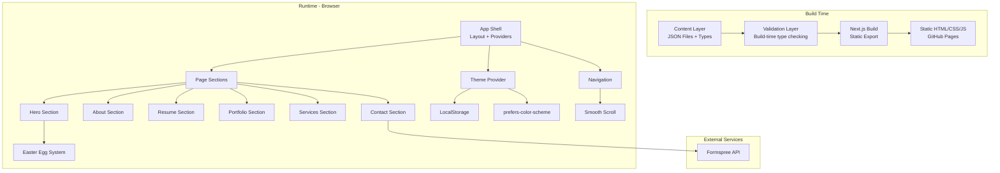
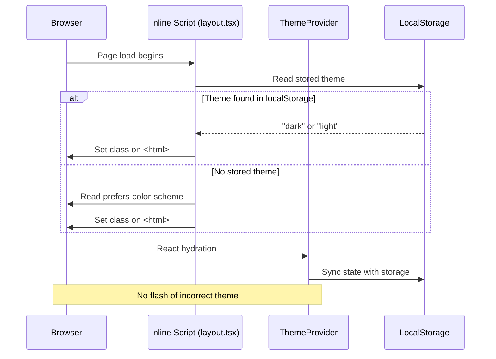
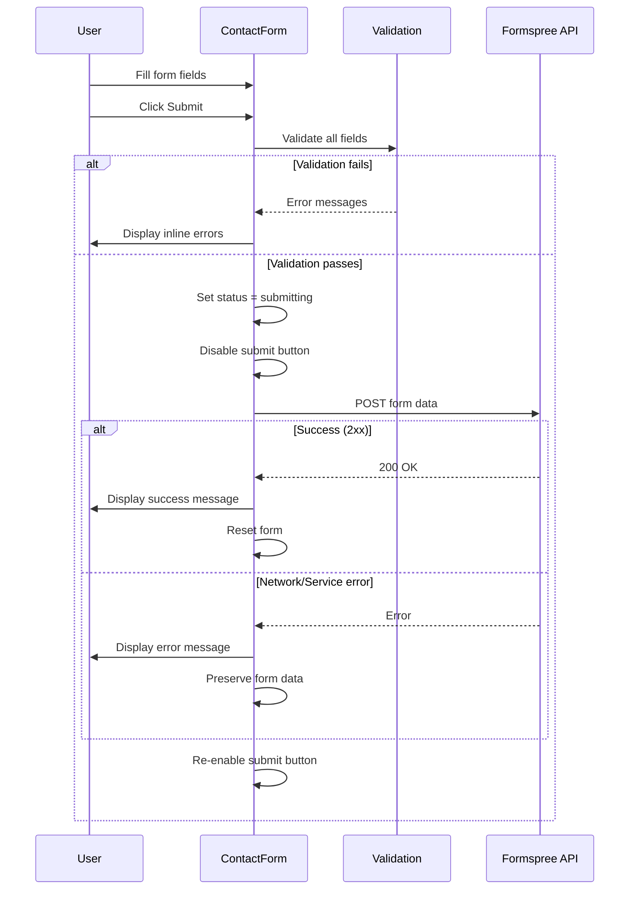
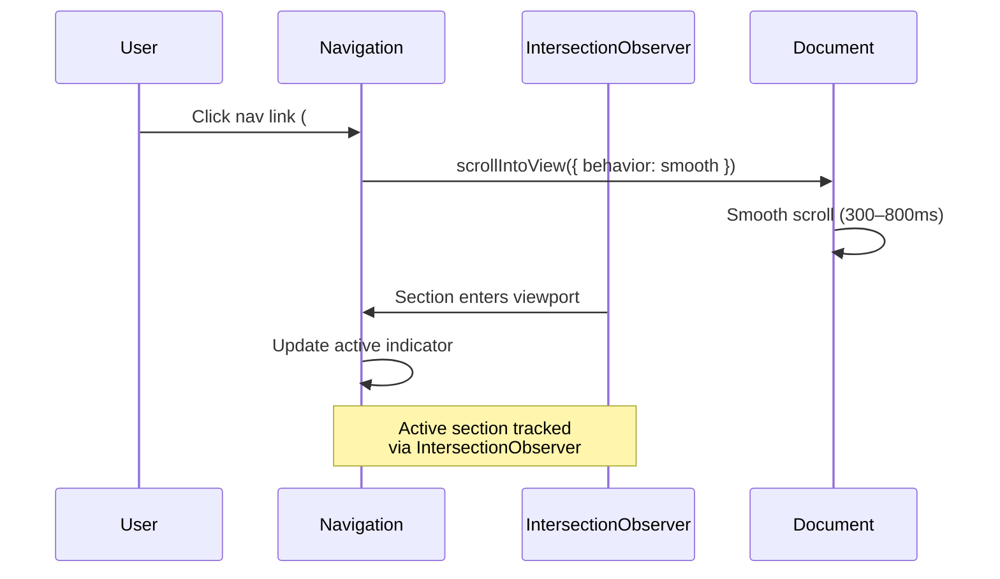

# Design Document: Portfolio Next.js Rewrite

## Overview

This document describes the technical architecture for rewriting hameedibrh.com as a modern Next.js 14+ application with App Router, static export, and a glassmorphism/Apple-inspired UI. The application is a single-page portfolio site with six main sections (Hero, About, Resume, Portfolio, Services, Contact), a file-based content layer, light/dark theme system, smooth-scroll navigation, easter eggs, and comprehensive SEO.

The site is deployed as a fully static export to GitHub Pages — no server runtime required. The tech stack centers on TypeScript (strict mode), Tailwind CSS for styling, `next/font` for font loading, Framer Motion for animations, and `react-icons` for iconography.

## Architecture



## Project Structure

```
portfolio-nextjs/
├── app/
│   ├── layout.tsx              # Root layout (fonts, metadata, providers)
│   ├── page.tsx                # Single page composing all sections
│   ├── globals.css             # Tailwind directives + custom properties
│   ├── sitemap.ts              # Dynamic sitemap generation
│   └── robots.ts               # Robots.txt generation
├── components/
│   ├── layout/
│   │   ├── Navigation.tsx      # Fixed nav with glassmorphism
│   │   ├── MobileDrawer.tsx    # Slide-out mobile menu
│   │   ├── Footer.tsx          # Site footer
│   │   └── SkipToContent.tsx   # Accessibility skip link
│   ├── sections/
│   │   ├── HeroSection.tsx     # Landing with typing animation
│   │   ├── AboutSection.tsx    # Bio, skills, profile image
│   │   ├── ResumeSection.tsx   # Timeline work/education
│   │   ├── PortfolioSection.tsx# Gallery grid with modals
│   │   ├── ServicesSection.tsx # Service cards grid
│   │   └── ContactSection.tsx  # Form + contact info
│   ├── ui/
│   │   ├── GlassCard.tsx       # Reusable glassmorphism card
│   │   ├── Button.tsx          # Button variants
│   │   ├── Modal.tsx           # Accessible modal with focus trap
│   │   ├── ProgressBar.tsx     # Animated skill progress bar
│   │   ├── Timeline.tsx        # Timeline layout component
│   │   ├── ThemeToggle.tsx     # Light/dark mode switch
│   │   └── TypingAnimation.tsx # Rotating text effect
│   └── easter-eggs/
│       ├── KonamiCode.tsx      # Konami code listener
│       └── CursorTracker.tsx   # Parallax cursor effect
├── content/
│   ├── personal.json           # Name, bio, greeting, roles
│   ├── social.json             # Social media links
│   ├── skills.json             # Skill categories + proficiency
│   ├── experience.json         # Work experience entries
│   ├── education.json          # Education entries
│   ├── portfolio.json          # Portfolio items
│   ├── services.json           # Service offerings
│   ├── contact.json            # Contact info + form config
│   └── seo.json                # SEO metadata, OG tags
├── lib/
│   ├── content.ts              # Content loading + validation
│   ├── types.ts                # TypeScript type definitions
│   └── validation.ts           # Build-time schema validation
├── hooks/
│   ├── useTheme.ts             # Theme state management
│   ├── useSmoothScroll.ts      # Scroll-to-section logic
│   ├── useInView.ts            # Intersection observer hook
│   ├── useKonamiCode.ts        # Konami code detection
│   ├── useReducedMotion.ts     # prefers-reduced-motion detection
│   └── useFormValidation.ts    # Contact form validation
├── public/
│   ├── images/                 # Optimized images
│   └── favicon.png
├── next.config.ts              # Static export config
├── tailwind.config.ts          # Theme tokens, glassmorphism utilities
├── tsconfig.json               # Strict TypeScript config
└── package.json
```

## Components and Interfaces

### Component 1: Theme Provider

**Purpose**: Manages light/dark mode state, persists preference, prevents flash of incorrect theme.

```typescript
interface ThemeContextValue {
  theme: 'light' | 'dark';
  toggleTheme: () => void;
  systemPreference: 'light' | 'dark';
}

interface ThemeProviderProps {
  children: React.ReactNode;
  defaultTheme?: 'light' | 'dark';
}
```

**Responsibilities**:
- Detect OS color scheme via `prefers-color-scheme` media query
- Read/write theme preference to `localStorage`
- Apply theme class to `<html>` element before first paint (via inline script in layout)
- Provide context to all child components
- Gracefully degrade when `localStorage` is unavailable

### Component 2: Navigation

**Purpose**: Fixed top navigation bar with glassmorphism backdrop, smooth scroll links, and responsive hamburger menu.

```typescript
interface NavItem {
  label: string;
  href: string;  // Section ID anchor (e.g., "#about")
}

interface NavigationProps {
  items: NavItem[];
  activeSection: string;
}
```

**Responsibilities**:
- Render fixed-position nav with `backdrop-filter: blur(12px)` glassmorphism
- Track active section via Intersection Observer
- Smooth scroll to target section on link click (300–800ms duration)
- Collapse to hamburger menu below 640px viewport
- Full keyboard navigation support with visible focus indicators
- Close mobile drawer on link click, outside tap, or close button

### Component 3: GlassCard

**Purpose**: Reusable glassmorphism container used across About, Services, and Portfolio sections.

```typescript
interface GlassCardProps {
  children: React.ReactNode;
  className?: string;
  hover?: boolean;       // Enable lift + glow on hover
  animate?: boolean;     // Enable entrance animation
  as?: React.ElementType; // Polymorphic element type
}
```

**Responsibilities**:
- Apply `backdrop-filter: blur(10–20px)` with translucent background (alpha 0.1–0.3)
- Provide fallback solid background for browsers without `backdrop-filter` support
- Optional hover animation: `translateY(-4px to -8px)` + colored `box-shadow` glow
- Adapt background opacity for dark mode (darker translucent tones)

### Component 4: Modal

**Purpose**: Accessible overlay for portfolio item details with focus trapping.

```typescript
interface ModalProps {
  isOpen: boolean;
  onClose: () => void;
  triggerRef: React.RefObject<HTMLElement>;
  children: React.ReactNode;
  title: string;
}
```

**Responsibilities**:
- Trap keyboard focus within modal when open
- Close on Escape key, outside click, or close button
- Return focus to trigger element on close
- Prevent body scroll while open
- Apply glassmorphism overlay backdrop
- Announce to screen readers via `role="dialog"` and `aria-modal`

### Component 5: HeroSection

**Purpose**: Full-viewport landing with animated roles, social links, CTA, and interactive background.

```typescript
interface HeroSectionProps {
  name: string;
  greeting: string;
  roles: string[];          // Max 5, displayed with typing animation
  socialLinks: SocialLink[];
  ctaLabel: string;
  ctaTarget: string;        // Section anchor
}
```

**Responsibilities**:
- Display typing/rotating animation cycling through roles
- Render animated gradient mesh or particle background behind content
- Track cursor position for parallax element movement (max 20px offset)
- Disable animations when `prefers-reduced-motion` is enabled
- Disable cursor tracking on touch-only devices

### Component 6: ContactSection

**Purpose**: Contact form with client-side validation and Formspree integration.

```typescript
interface ContactFormData {
  name: string;       // max 100 chars
  email: string;      // max 254 chars, email format
  subject: string;    // max 200 chars
  message: string;    // max 2000 chars
}

interface ContactSectionProps {
  contactInfo: ContactInfo;
  formspreeEndpoint: string;
}

type FormStatus = 'idle' | 'submitting' | 'success' | 'error';
```

**Responsibilities**:
- Validate all fields client-side before submission
- Display inline error messages per field
- Submit to Formspree endpoint
- Show loading state during submission (disable button)
- Display success/error messages
- Preserve form data on submission failure

## Data Models

### Content Type Definitions

```typescript
// lib/types.ts

interface PersonalInfo {
  name: string;
  greeting: string;
  roles: string[];           // 1–5 items
  bio: string;
  profileImage: string;      // Path relative to /public
  profileImageAlt: string;   // 5–150 chars
  ctaLabel: string;
  ctaTarget: string;
}

interface SocialLink {
  platform: string;          // Max 50 chars
  url: string;               // Valid URL
  icon: string;              // react-icons identifier
}

interface SkillCategory {
  category: string;
  skills: Skill[];
}

interface Skill {
  name: string;
  proficiency: number;       // 0–100
}

interface ExperienceEntry {
  role: string;
  organization: string;
  organizationUrl?: string;
  startDate: string;         // ISO date or descriptive
  endDate: string;           // ISO date, "Present", or descriptive
  description: string;       // Max 500 chars
}

interface EducationEntry {
  degree: string;
  institution: string;
  institutionUrl?: string;
  startDate: string;
  endDate: string;
  description: string;       // Max 500 chars
}

interface PortfolioItem {
  id: string;
  title: string;
  category: string;
  thumbnail: string;         // Image path
  thumbnailAlt: string;      // 5–150 chars
  description: string;
  externalUrl: string;
}

interface ServiceItem {
  icon: string;              // react-icons identifier
  title: string;
  description: string;       // Max 150 chars
}

interface ContactInfo {
  email: string;
  phone: string;
  location: string;
}

interface SEOData {
  title: string;             // 30–60 chars
  description: string;       // 50–160 chars
  siteUrl: string;
  ogImage: string;
  twitterHandle?: string;
  personSchema: {
    name: string;
    jobTitle: string;
    url: string;
    sameAs: string[];        // Social profile URLs
  };
}
```

**Validation Rules**:
- All content files must parse as valid JSON
- All fields defined in type interfaces are required unless marked optional
- String length constraints enforced at build time
- URLs validated against URL format pattern
- Proficiency values clamped to 0–100 range
- Build fails with descriptive error if validation fails

## Sequence Diagrams

### Theme Initialization Flow



### Contact Form Submission Flow



### Navigation Smooth Scroll Flow



## Theme System Design

### Color Tokens (Tailwind Config)

```typescript
// tailwind.config.ts (partial)
const config = {
  darkMode: 'class',
  theme: {
    extend: {
      colors: {
        // Primary gradient palette
        primary: {
          purple: '#8B5CF6',
          blue: '#3B82F6',
          teal: '#14B8A6',
        },
        // Glass backgrounds
        glass: {
          light: 'rgba(255, 255, 255, 0.15)',
          dark: 'rgba(0, 0, 0, 0.25)',
          border: 'rgba(255, 255, 255, 0.18)',
        },
        // Surface colors
        surface: {
          light: '#FAFAFA',
          dark: '#0F0F1A',
        },
      },
      backdropBlur: {
        glass: '12px',
      },
      animation: {
        'fade-in': 'fadeIn 0.4s ease-out',
        'slide-up': 'slideUp 0.4s ease-out',
        'typing': 'typing 3.5s steps(40) infinite',
      },
    },
  },
};
```

### Glassmorphism Utility Classes

```css
/* globals.css */
@layer utilities {
  .glass {
    @apply backdrop-blur-glass bg-glass-light dark:bg-glass-dark 
           border border-glass-border rounded-2xl;
  }
  
  .glass-nav {
    @apply backdrop-blur-glass bg-white/80 dark:bg-black/60 
           border-b border-glass-border;
  }
}

/* Fallback for browsers without backdrop-filter */
@supports not (backdrop-filter: blur(12px)) {
  .glass {
    @apply bg-white/90 dark:bg-gray-900/90;
  }
}
```

### Flash Prevention (Inline Script)

```typescript
// Injected in app/layout.tsx <head> as inline script
const themeScript = `
  (function() {
    var stored = null;
    try { stored = localStorage.getItem('theme'); } catch(e) {}
    var theme = stored || 
      (window.matchMedia('(prefers-color-scheme: dark)').matches ? 'dark' : 'light');
    document.documentElement.classList.add(theme);
  })();
`;
```

## Easter Egg System

### Konami Code Detection

```typescript
// hooks/useKonamiCode.ts
interface KonamiCodeConfig {
  onActivate: () => void;
  sequence?: string[];  // Default: ↑↑↓↓←→←→BA
}
```

**Implementation approach**:
- Listen for `keydown` events on `window`
- Maintain a buffer of recent key presses
- Compare buffer against the Konami sequence
- Trigger visual overlay effect (1–5 seconds) on match
- Effect renders as overlay without layout shift
- Auto-dismiss after animation completes

### Cursor Parallax Tracker

```typescript
// components/easter-eggs/CursorTracker.tsx
interface CursorTrackerProps {
  children: React.ReactNode;
  maxOffset: number;      // Max 20px translation
  maxRotation: number;    // Max 10 degrees
}
```

**Implementation approach**:
- Track `mousemove` events within Hero section bounds
- Calculate offset proportional to cursor distance from center
- Apply CSS `transform: translate(x, y) rotate(deg)` via Framer Motion
- Disable entirely on touch-only devices (no pointer events support)
- Disable when `prefers-reduced-motion` is active

## Performance Optimization

### Static Export Configuration

```typescript
// next.config.ts
const nextConfig: NextConfig = {
  output: 'export',
  images: {
    unoptimized: false,  // Use next/image optimization at build
  },
  trailingSlash: true,   // GitHub Pages compatibility
};
```

### Image Optimization Strategy

| Image Type | Loading | Priority | Format |
|------------|---------|----------|--------|
| Hero background | eager | high | WebP/AVIF |
| Profile photo | eager | high | WebP |
| Portfolio thumbnails | lazy | low | WebP |
| Service icons | inline SVG | — | SVG |

### Code Splitting Approach

```mermaid
graph LR
    subgraph Initial Bundle < 200KB gzipped
        A[App Shell] --> B[Navigation]
        A --> C[ThemeProvider]
        A --> D[HeroSection]
    end
    
    subgraph Lazy Loaded
        E[Modal Component]
        F[Portfolio Gallery]
        G[Contact Form Logic]
        H[Easter Egg Effects]
    end
    
    D -.->|scroll proximity| F
    F -.->|user click| E
    D -.->|keydown match| H
```

**Strategy**:
- Hero section and navigation load immediately (above the fold)
- Sections below Hero use `next/dynamic` with Intersection Observer trigger (200px threshold)
- Modal content loads on-demand when user opens a portfolio item
- Easter egg effects load only when triggered
- Framer Motion tree-shaken to include only used animation primitives

### Font Loading

```typescript
// app/layout.tsx
import { Inter, Lora } from 'next/font/google';

const inter = Inter({
  subsets: ['latin'],
  display: 'swap',
  variable: '--font-sans',
});

const lora = Lora({
  subsets: ['latin'],
  display: 'swap',
  variable: '--font-serif',
});
```

- `next/font` handles preloading and self-hosting
- `display: swap` ensures zero CLS from font loading
- CSS variables enable Tailwind integration

## SEO Implementation

### Metadata Generation

```typescript
// app/layout.tsx
import { Metadata } from 'next';
import seoData from '@/content/seo.json';

export const metadata: Metadata = {
  title: seoData.title,
  description: seoData.description,
  openGraph: {
    title: seoData.title,
    description: seoData.description,
    url: seoData.siteUrl,
    type: 'website',
    images: [{ url: seoData.ogImage }],
  },
  twitter: {
    card: 'summary_large_image',
    title: seoData.title,
    description: seoData.description,
    images: [seoData.ogImage],
  },
};
```

### JSON-LD Structured Data

```typescript
// Rendered in app/layout.tsx
const personSchema = {
  '@context': 'https://schema.org',
  '@type': 'Person',
  name: seoData.personSchema.name,
  jobTitle: seoData.personSchema.jobTitle,
  url: seoData.personSchema.url,
  sameAs: seoData.personSchema.sameAs,
};

// <script type="application/ld+json">{JSON.stringify(personSchema)}</script>
```

### Sitemap Generation

```typescript
// app/sitemap.ts
import { MetadataRoute } from 'next';

export default function sitemap(): MetadataRoute.Sitemap {
  return [
    {
      url: 'https://hameedibrh.com',
      lastModified: new Date(),
      changeFrequency: 'monthly',
      priority: 1,
    },
  ];
}
```

### Semantic HTML Structure

```
<body>
  <a class="skip-to-content" href="#main">Skip to content</a>
  <header> <!-- Navigation --> </header>
  <main id="main">
    <section id="hero" aria-label="Introduction">
      <h1>Hameed Ibrahim</h1>
    </section>
    <section id="about" aria-label="About">
      <h2>About</h2>
    </section>
    <section id="resume" aria-label="Resume">
      <h2>Resume</h2>
      <h3>Work Experience</h3>
      <h3>Education</h3>
    </section>
    <section id="portfolio" aria-label="Portfolio">
      <h2>Portfolio</h2>
    </section>
    <section id="services" aria-label="Services">
      <h2>Services</h2>
    </section>
    <section id="contact" aria-label="Contact">
      <h2>Contact</h2>
    </section>
  </main>
  <footer> <!-- Footer content --> </footer>
</body>
```

## Accessibility Patterns

### Focus Management

- Skip-to-content link as first focusable element
- Visible focus indicators: 2px outline with ≥3:1 contrast ratio
- Modal focus trap using `focus-trap-react` or manual implementation
- Focus returned to trigger element on modal close
- All interactive elements reachable via Tab key

### ARIA Implementation

| Component | ARIA Attributes |
|-----------|----------------|
| Navigation | `role="navigation"`, `aria-label="Main"` |
| Mobile menu | `aria-expanded`, `aria-controls` |
| Theme toggle | `aria-label="Toggle dark mode"`, `aria-pressed` |
| Modal | `role="dialog"`, `aria-modal="true"`, `aria-labelledby` |
| Progress bars | `role="progressbar"`, `aria-valuenow`, `aria-valuemin`, `aria-valuemax` |
| Social links | `aria-label="Visit [platform] profile"` |
| Portfolio items | `aria-haspopup="dialog"` |

### Reduced Motion

```typescript
// hooks/useReducedMotion.ts
export function useReducedMotion(): boolean {
  const [reduced, setReduced] = useState(false);
  
  useEffect(() => {
    const mq = window.matchMedia('(prefers-reduced-motion: reduce)');
    setReduced(mq.matches);
    const handler = (e: MediaQueryListEvent) => setReduced(e.matches);
    mq.addEventListener('change', handler);
    return () => mq.removeEventListener('change', handler);
  }, []);
  
  return reduced;
}
```

When `prefers-reduced-motion` is active:
- Typing animation replaced with static text showing first role
- Background gradient mesh becomes static
- Scroll-triggered entrance animations become instant
- Hover transitions reduced to opacity-only changes
- Cursor parallax effect disabled entirely

### Color Contrast

- Body text (16px): minimum 4.5:1 ratio in both themes
- Large text (18px+): minimum 3:1 ratio
- UI components and focus indicators: minimum 3:1 ratio
- Glassmorphism backgrounds tested with text overlay for compliance
- Dark mode uses lighter text on darker translucent surfaces

## Correctness Properties

### Property 1: Theme Consistency

For all page loads, the rendered theme MUST match either the stored localStorage value or the OS preference — no flash of incorrect theme is ever visible.

**Validates: Requirements 4.2, 4.4, 4.7**

### Property 2: Content Completeness

For all content files in `/content`, the build succeeds if and only if every file parses as valid JSON AND conforms to its TypeScript/Zod schema definition.

**Validates: Requirements 2.4, 2.6, 2.7**

### Property 3: Navigation Idempotency

For all navigation link clicks, clicking the same link multiple times produces the same scroll position, and the active indicator always reflects the currently visible section.

**Validates: Requirements 1.6**

### Property 4: Modal Focus Invariant

Whenever a modal is open, keyboard focus is trapped within the modal boundary. When closed, focus returns to the exact element that triggered the modal.

**Validates: Requirements 15.4, 8.5**

### Property 5: Accessibility Contrast

For all text elements in both light and dark modes, the computed contrast ratio between text color and its effective background meets WCAG 2.1 AA minimums (4.5:1 normal text, 3:1 large text).

**Validates: Requirements 3.6, 15.5**

### Property 6: Responsive Layout

For all viewport widths from 320px to 2560px, no horizontal scrollbar appears and all content remains accessible without horizontal scrolling.

**Validates: Requirements 11.1**

### Property 7: Reduced Motion Respect

When `prefers-reduced-motion: reduce` is active, no CSS animation or transition with duration > 0ms runs on non-essential decorative elements.

**Validates: Requirements 15.7, 5.6**

### Property 8: Form Validation Completeness

For all possible form submissions, the form is submitted to Formspree if and only if all four fields pass their respective validation rules (non-empty, within length limits, email format valid).

**Validates: Requirements 10.2, 10.3, 10.5**

### Property 9: Static Export Integrity

The build output contains only static files (HTML, CSS, JS, images) with zero server-side runtime dependencies — every page is fully functional when served from any static file host.

**Validates: Requirements 1.4**

### Property 10: Easter Egg Non-Interference

Easter egg effects render as overlays or inline effects that never cause layout shift (CLS = 0) and never displace existing page content.

**Validates: Requirements 14.2**

## Error Handling

### Build-Time Content Validation

**Condition**: Content file missing, malformed JSON, or schema mismatch
**Response**: Build process exits with non-zero code and descriptive error
**Recovery**: Developer fixes content file and re-runs build

```typescript
// lib/validation.ts
function validateContent<T>(filePath: string, schema: ZodSchema<T>): T {
  const raw = fs.readFileSync(filePath, 'utf-8');
  const parsed = JSON.parse(raw);  // Throws on invalid JSON
  const result = schema.safeParse(parsed);
  
  if (!result.success) {
    const errors = result.error.issues.map(i => 
      `  - ${i.path.join('.')}: ${i.message}`
    ).join('\n');
    throw new Error(
      `Content validation failed for ${filePath}:\n${errors}`
    );
  }
  return result.data;
}
```

### Runtime Error Scenarios

| Scenario | Response | Recovery |
|----------|----------|----------|
| Formspree submission fails | Display error message | Preserve form data, allow retry |
| Image fails to load | Show placeholder with alt text | Graceful degradation |
| localStorage unavailable | Use OS preference, no persistence | In-session toggle still works |
| backdrop-filter unsupported | Solid semi-opaque fallback | CSS @supports query |
| JavaScript disabled | All content visible in HTML | Static page, no interactions |

## Testing Strategy

### Unit Testing Approach

- Test content validation logic with valid/invalid fixtures
- Test form validation rules (email format, length constraints)
- Test theme toggle logic and localStorage interaction
- Test Konami code sequence detection
- Framework: Vitest + React Testing Library

### Integration Testing Approach

- Test full section rendering with mock content data
- Test navigation scroll behavior
- Test modal open/close/focus-trap cycle
- Test theme persistence across simulated page reloads
- Test responsive breakpoint behavior

### Accessibility Testing

- Automated: axe-core integration in test suite
- Manual: keyboard navigation walkthrough
- Screen reader testing with NVDA/VoiceOver
- Color contrast verification with browser DevTools

## Performance Considerations

| Metric | Target | Strategy |
|--------|--------|----------|
| Lighthouse Performance (Desktop) | ≥90 | Static export, optimized images, code splitting |
| Lighthouse Performance (Mobile) | ≥80 | Lazy loading, minimal JS, responsive images |
| First Contentful Paint | <1.5s | Inline critical CSS, preloaded fonts |
| Cumulative Layout Shift | <0.1 | next/font swap, sized image containers |
| Total JS Bundle (gzipped) | <200KB | Tree shaking, dynamic imports, minimal deps |
| Time to Interactive | <3s | Deferred non-critical JS |

## Security Considerations

- No server-side code — static export eliminates server attack surface
- Form submission via Formspree (third-party handles CSRF, rate limiting)
- Client-side input validation prevents malformed submissions
- No sensitive data stored client-side (only theme preference in localStorage)
- Content Security Policy headers configured via GitHub Pages `_headers` file or meta tags
- External links use `rel="noopener noreferrer"` for security

## Dependencies

| Package | Purpose | Version Strategy |
|---------|---------|-----------------|
| next | Framework (App Router, static export) | ^14.0.0 |
| react / react-dom | UI library | ^18.0.0 |
| typescript | Type safety | ^5.0.0 |
| tailwindcss | Utility-first CSS | ^3.4.0 |
| framer-motion | Animations | ^11.0.0 |
| react-icons | Icon library | ^5.0.0 |
| zod | Content schema validation | ^3.22.0 |
| @tailwindcss/typography | Prose styling (optional) | ^0.5.0 |

**Dev Dependencies**:
| Package | Purpose |
|---------|---------|
| vitest | Test runner |
| @testing-library/react | Component testing |
| axe-core | Accessibility testing |
| eslint + prettier | Code quality |
